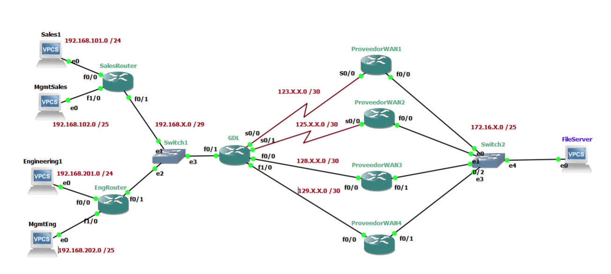

# PBR

## Network Diagram



## Introduction

This lab outlines the necessary configuration steps to achieve IPv4 routing convergence across seven routers using a preferred internal routing protocol. The primary objective is to ensure seamless communication and optimal path selection within the network by implementing policy-based routing (PBR) and leveraging the chosen routing protocol's capabilities. Policy-based routing allows for flexible traffic management by enabling routers to make routing decisions based on predefined policies rather than relying solely on traditional routing tables. This approach is particularly useful in complex network topologies where specific traffic flows require customized routing paths. 

This exercise demonstrates the practical application of policy-based routing and internal routing protocols in real-world scenarios, highlighting their importance in maintaining robust and scalable network infrastructures.

## Objective

Perform the necessary configuration in the SEVEN routers to achieve IPv4 routing convergence between the internal routing protocols, based on the topology shown in the diagram.

## Development

This document details the assigned IP addresses, subnet masks and Routing Protocols. Additionally, it includes configuration guidelines for routers, policies, redistribution points, and routing features. The network consists of seven routers running different routing protocols (EIGRP, GLBP), as shown in the network diagram. The table below summarizes the IP addresses assignments:


| Device   | Interface | IP              | Mask            | CIDR | EIGRP | Protocol |
| -------- | --------- | --------------- | --------------- | ---- | ----- | -------- |
| SalesR   | f0/0      | 192.168.101.1   | 255.255.255.0   | /24  | 100   | NA       |
|          | f1/0      | 192.168.102.129 | 255.255.255.128 | /25  |       |          |
| EngR     | f0/0      | 192.168.201.1   | 255.255.255.0   | /24  | 100   | NA       |
|          | f1/0      | 192.168.202.129 | 255.255.255.128 | /25  |       |          |
| GDL      | f0/1      | 192.168.4.3     | 255.255.255.248 | /29  | 100   | NA       |
|          | s0/0      | 123.4.4.1       | 255.255.255.252 | /30  |       |          |
|          | s0/1      | 125.4.4.1       | 255.255.255.252 | /30  |       |          |
|          | s1/0      | 128.4.4.1       | 255.255.255.252 | /30  |       |          |
|          | s1/1      | 129.4.4.1       | 255.255.255.252 | /30  |       |          |
| WAN      | s0/0      | 123.4.4.2       | 255.255.255.252 | /30  | 100   | glbp     |
|          | f0/0      | 172.16.4.1      | 255.255.255.128 | /25  |       |          |
| WAN2     | s2/0      | 125.4.4.0       | 255.255.255.252 | /30  | 100   | glbp     |
|          | f0/0      | 172.16.4.2      | 255.255.255.128 | /25  |       |          |
| WAN3     | s2/0      | 128.4.4.2       | 255.255.255.252 | /30  | 100   | glbp     |
|          | f0/0      | 172.16.4.3      | 255.255.255.128 | /25  |       |          |
| WAN4     | s2/0      | 129.4.4.2       | 255.255.255.252 | /30  | 100   | glbp     |
|          | f0/0      | 172.16.4.4      | 255.255.255.128 | /25  |       |          |
| Sales1   | f0/0      | 192.168.101.100 | 255.255.255.0   | /24  | NA    | NA       |
| Mgmt     | f0/0      | 192.168.102.130 | 255.255.255.128 | /25  | NA    | NA       |
| Eng      | f0/0      | 192.168.201.100 | 255.255.255.0   | /24  | NA    | NA       |
| MgmtEng  | f0/0      | 192.168.202.130 | 255.255.255.128 | /25  | NA    | NA       |
| FileSrvr | f0/0      | 192.168.202.100 | 255.255.255.128 | /25  | NA    | NA       |

In order to configure the routers the following commands must be used:

* **Routers IP**
```shell
conf t 
int [Interface]
no switchport # Only if this is part of a 16 ports expansion 
ip address [IP] [MASK] 
no shutdown
```

* **Configure EIGRP**
```shell
router eigrp [N]
network [IP address] [Wildcard Mask]
no auto summary #only if needed
```

* **Configure GLBP**
```shell
interface [type number]
glbp [group] [ip address]
glbp [group] priority [level]
glbp [group] preempt
```

* **Configure Access Lists**
```shell
access-list access-list-number {permit} {source [source-wildcar] any}
```

* **Configure Policies**
```shell
interface [type number]
ip policy route-map [route-map_name]

route-map [route-map_name] [sequence_number]
match ip address [match_criteria_name]
set ip next-hop [ip address]
```

And lastly, the configuration for VPCs is the following:
```shell
ip [ip_address]/[mask] [gateway]
```
