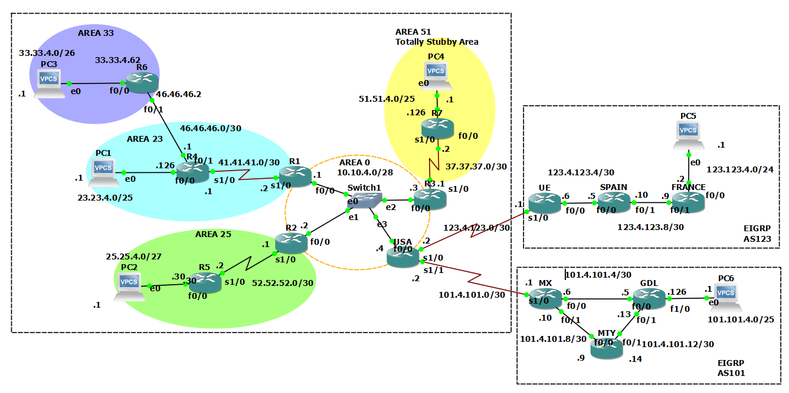

# REDISTRIBUTION

## Network diagram

## Introduction

This lab report documents the configuration and implementation of redistribution between EIGRP and OSPF across multiple Autonomous Systems (AS) to achieve full IPv4 routing convergence. An AS is a collection of IP networks managed under a single administrative domain, enabling unified routing policies.

The lab focuses on two key protocols: EIGRP, a Cisco-proprietary protocol known for its fast convergence and efficient bandwidth usage, and OSPF, an open-standard protocol that organizes networks into hierarchical areas for scalability. Redistribution, the process of exchanging routes between these protocols, ensures seamless communication across AS boundaries.

Successful redistribution requires careful metric mapping to avoid routing loops and ensure optimal path selection. By configuring redistribution policies, virtual links, and OSPF stub areas, this practice achieves full connectivity across 14 routers, demonstrating the practical application of these protocols in complex network topologies.

## Objective

Perform the necessary configuration in the FOURTEEN routers to achieve IPv4 routing convergence using REDISTRIBUTION between the internal routing protocols, based on the topology shown in the diagram.